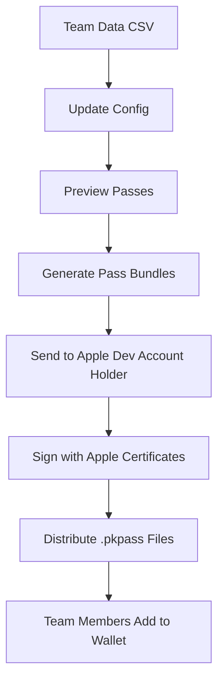

# Apple Wallet Pass Generation Guide

This guide explains how to create Apple Wallet passes for your Scalewave team contact cards.

## 🎯 Overview

The Apple Wallet pass system allows you to create digital business cards that:
- ✅ Live in Apple Wallet app on iPhones
- ✅ Include QR codes linking to your contact card pages
- ✅ Display essential contact information
- ✅ Match your company branding
- ✅ Can be shared instantly via AirDrop, email, or QR codes

## 🔧 Prerequisites

1. **Someone with Apple Developer Account** ($99/year)
   - They need to create a "Pass Type ID" in their Apple Developer portal
   - They need their "Team ID" from the account

2. **Python dependencies installed**
   ```bash
   pip install -r requirements.txt
   ```

3. **Your contact cards already deployed**
   - GitHub Pages URL where your contact cards live
   - Example: `https://kaib03.github.io/digital-contact-cards/`

## 🚀 Quick Start

### Step 1: Configure the Generator

1. **Get Apple Developer Info** from your colleague:
   ```
   Pass Type ID: pass.com.yourcompany.yourapp.type
   Team ID: ABC123DEFG (10-character string)
   ```

2. **Update `config_wallet_passes.py`**:
   ```python
   PASS_TYPE_IDENTIFIER = "pass.com.scalewave.contacts.team"  # From colleague
   TEAM_IDENTIFIER = "ABC123DEFG"  # From colleague
   GITHUB_PAGES_URL = "https://kaib03.github.io/digital-contact-cards/"  # Your actual URL
   ```

3. **Test configuration**:
   ```bash
   python config_wallet_passes.py
   ```

### Step 2: Preview Your Passes (Optional but Recommended)

Before generating the final pass bundles, you can create visual previews:

```bash
python scripts/preview_wallet_pass.py
```

This creates preview images showing exactly how your passes will look in Apple Wallet, including:
- Your Scalewave brand colors (INNOVACIÓN blue background, PROFESIONALISMO light text, CONFIANZA green labels)
- Clean, professional layout with only: Name, Title, Logo, and QR code
- QR codes linking to each person's contact card

Preview images will be saved to `pass_previews/` folder.

### Step 3: Generate Pass Bundles

Once you're happy with the preview:

```bash
python scripts/generate_wallet_passes.py
```

This creates a `wallet_passes/` folder with:
- Individual pass folders for each team member
- pass.json files with all the contact data
- Required logo/icon images
- Signing instructions for your colleague

### Step 4: Send to Apple Developer Account Holder

Send the entire `wallet_passes/` folder to your colleague. They will:

1. Download `signpass` utility from Apple Developer portal
2. Run signing commands for each pass folder:
   ```bash
   ./signpass -p jane-doe_pass
   ./signpass -p john-smith_pass
   # etc.
   ```
3. Send back the `.pkpass` files

### Step 5: Distribute Passes

Each `.pkpass` file can be:
- **Emailed** to team members (they tap to add to Wallet)
- **Shared via AirDrop** 
- **Hosted on website** with "Add to Apple Wallet" buttons
- **Linked via QR codes** (print on business cards, etc.)

## 📁 Generated Structure

After running the generator:

```
wallet_passes/
├── jane-doe_pass/
│   ├── pass.json          # Pass data and QR code
│   ├── icon.png           # App icon (29x29)
│   ├── icon@2x.png        # App icon (58x58)
│   ├── icon@3x.png        # App icon (87x87)
│   ├── logo.png           # Company logo (160x50)
│   ├── logo@2x.png        # Company logo (320x100)
│   └── logo@3x.png        # Company logo (480x150)
├── john-smith_pass/
│   └── ... (same structure)
├── sarah-johnson_pass/
│   └── ... (same structure)
├── michael-brown_pass/
│   └── ... (same structure)
└── SIGNING_INSTRUCTIONS.md
```

## 🎨 Customization

### Styling Options

Edit `config_wallet_passes.py` to change colors:

```python
# Dark theme (default)
PASS_STYLING = {
    "backgroundColor": "rgb(25, 25, 25)",
    "foregroundColor": "rgb(255, 255, 255)", 
    "labelColor": "rgb(200, 200, 200)",
}

# Professional blue
PASS_STYLING = {
    "backgroundColor": "rgb(0, 51, 102)",
    "foregroundColor": "rgb(255, 255, 255)",
    "labelColor": "rgb(173, 216, 230)",
}
```

### Logo Handling

The generator will:
1. **Download logos** from `company_logo_url` in your CSV
2. **Resize automatically** to Apple's required dimensions
3. **Create fallback icons** with company initials if logo fails

## 🔄 What Signing Actually Does

The signing process:
1. **Validates** the pass structure
2. **Creates cryptographic signature** using Apple certificates
3. **Packages everything** into a `.pkpass` file
4. **Ensures authenticity** so Apple Wallet trusts the pass

**Command line example:**
```bash
# Input: jane-doe_pass/ folder with pass.json + images
./signpass -p jane-doe_pass
# Output: jane-doe_pass.pkpass file ready for distribution
```

## 📱 How Users Add Passes

1. **Receive .pkpass file** (email, AirDrop, download)
2. **Tap the file** on iPhone
3. **Apple Wallet opens** showing pass preview
4. **Tap "Add"** to save to Wallet
5. **Scan QR code** to view full contact card page

## 🎯 Integration with Contact Cards

Each Apple Wallet pass contains:

### Front of Pass:
- **Name** (large, primary field)
- **Title** and **Company** (secondary fields)  
- **Phone** (auxiliary field)
- **QR Code** (links to full contact page)

### Back of Pass:
- **Email address**
- **LinkedIn URL**
- **Twitter URL** (if available)

### QR Code Links To:
- Your deployed GitHub Pages contact card
- Example: `https://scalewave.github.io/team-contacts/html/jane-doe.html`

## 🔧 Troubleshooting

### Configuration Issues
```bash
# Test your config
python config_wallet_passes.py

# Common fixes:
# - Update Pass Type ID from Apple Developer Account
# - Update Team ID from Apple Developer Account  
# - Fix GitHub Pages URL (no trailing slash)
```

### Image Issues
- **Logo not downloading?** Check `company_logo_url` in CSV
- **Images look bad?** Generator auto-resizes, but higher resolution source helps
- **Missing images?** Generator creates text-based fallbacks

### Signing Issues (for colleague)
- **Certificate not found?** Install Pass Type ID certificate in Keychain
- **WWDR missing?** Download Apple Worldwide Developer Relations certificate
- **Wrong Team ID?** Verify in Apple Developer portal under "Membership"

## 📋 Workflow Summary



## 🚀 Next Steps

1. **Configure** the generator with your Apple Developer details
2. **Preview** passes for visual confirmation
3. **Generate** pass bundles for your team
4. **Send** to signing colleague
5. **Distribute** signed passes
6. **Enjoy** seamless contact sharing! 

Your team can now share contact information instantly by showing their Apple Wallet pass and letting others scan the QR code! 📱✨ 